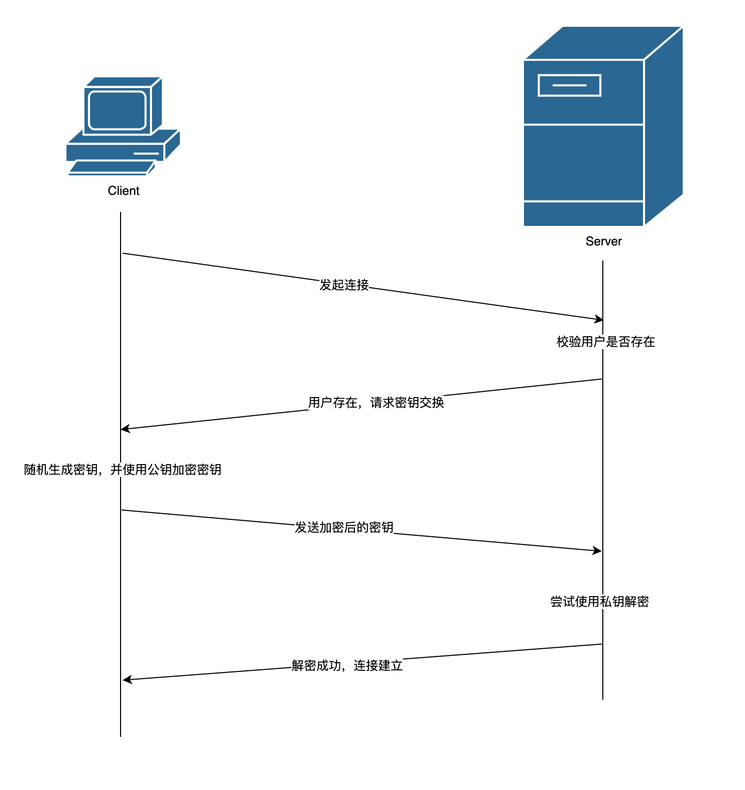
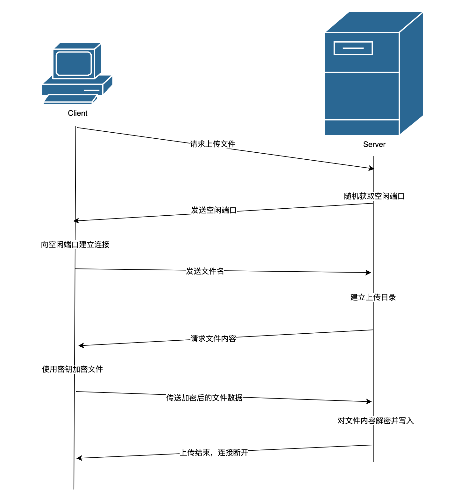
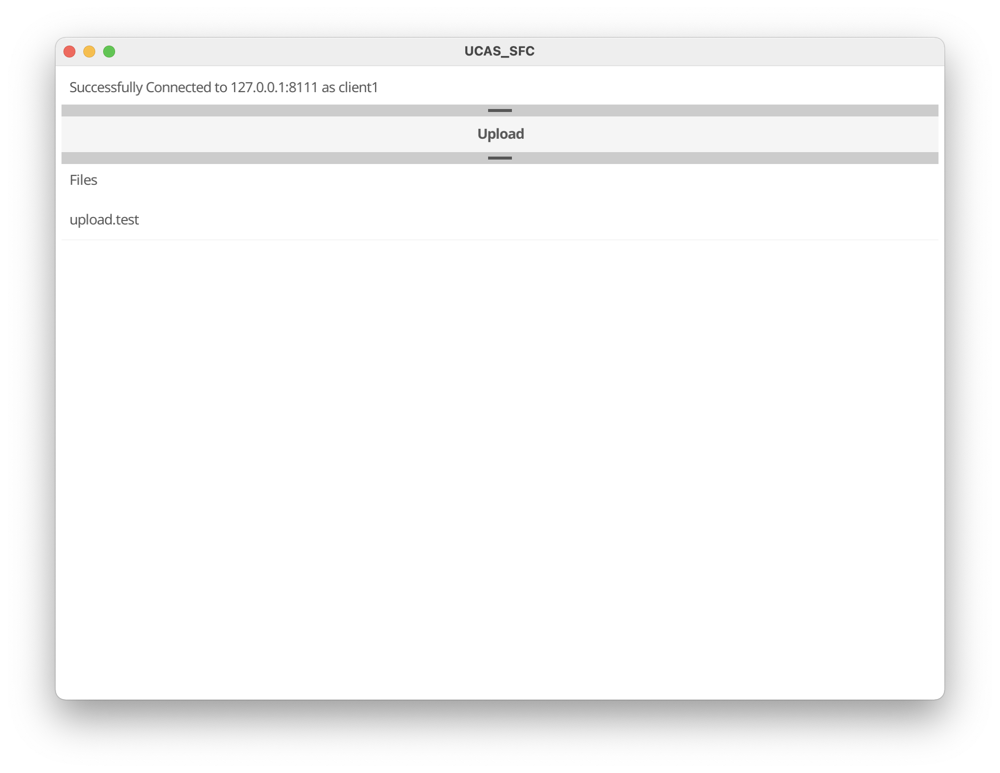
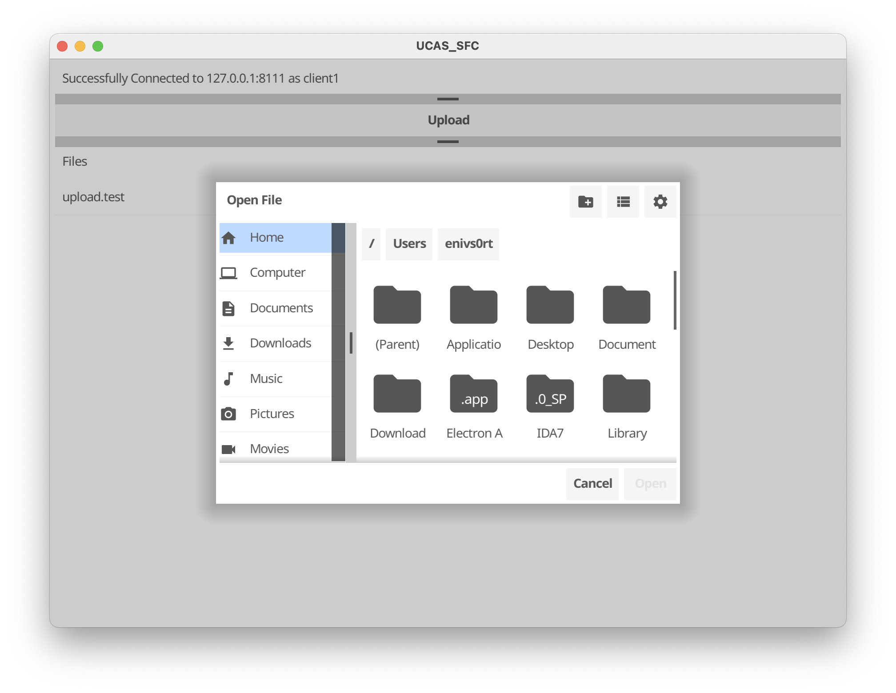

#### 网络攻防基础实验—安全文件传输软件设计与实现
国科大 网络攻防基础 2022-2023 春季 课程作业
##### 项目介绍
github 仓库：https://github.com/enivS0rt/UCAS_SFC  
项目使用 golang 语言开发，客户端 gui 基于 fyne 框架实现  
核心功能基于 net 库开发
项目在 MacOs Big Sur 11.6.5 下测试通过，由于 golang 具有跨平台特性，Win 和 unix 系统理论均可运行。

```text
.
├── Readme.md
├── client
│   ├── Client
│   │   └── Client.go
│   ├── Main.go
│   ├── config.ini
│   ├── rsa.pub
│   └── upload.test
├── go.mod
├── go.sum
└── server
    ├── Main.go
    ├── Server
    │   └── Sever.go
    ├── config.ini
    └── secKeys
        └── client1.sec
```
##### 项目功能
项目设计和实现了一个安全的文件传输过程，编码实现了 client 和 server 两个参与者。   
交互过程如下 首先是用户连接的建立



用户连接建立后可以列举上传的目录，请求上传文件等，其中上传交互过程如下



Client 与 Server 首先通过非对称加密交换了后续使用的对称加密密钥，后续文件上传使用对称加密算法加密传输。公私钥预先内置在 Client 和 Server，保证了对中间人攻击的抵御。  
##### 客户端主界面



最上一栏显示当前连接信息，中间一栏负责选择文件进行上传，下面一栏负责展示在 server 端已经上传存在的文件



##### Server 端

Server 端使用 goroutine 处理客户端连接 实现了并发 tcp 服务，可以同时与多个客户端通信

```go
func (server *Server) Start() {
	listen, err := net.Listen("tcp", server.addr+":"+server.port)
	if err != nil {
		panic(err)
	}
	fmt.Println("Server running at " + server.addr + ":" + server.port)
	for {
		con, err := listen.Accept()
		if err != nil {
			fmt.Print(err)
			continue
		}
		go handleConnect(con, server.secKeyDir)
	}
}
```

